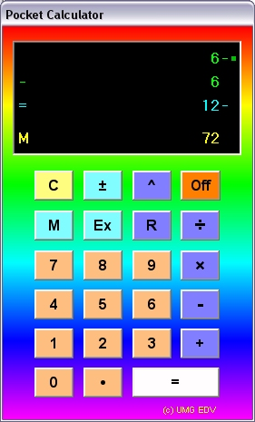



## Pocket Calculator using a State Transition Table

### Description

This pocket calculator is meant as an example for the almost forgotten State Transition Table technique. With this technique the complete behaviour pattern is stored in a two-dimensional table containig Reactions to input-triggers (in this case key presses, but depending on circumstances the triggers may be anything else), and States. An STT is an ideal tool to control game characters for example because it allows different reactions to identical inputs.

The code is documented and also contains a short description of how it works. It's worth the download if you want to learn more about STTs, so give it a try. Download is 18 kB.
 
### More Info
 

             |
---                |---
**Submitted On**   |2002-04-19 15:26:00
**By**             |[ULLI](https://github.com/Planet-Source-Code/PSCIndex/blob/master/ByAuthor/ulli.md)
**Level**          |Intermediate
**User Rating**    |5.0 (20 globes from 4 users)
**Compatibility**  |VB 6\.0
**Category**       |[Math/ Dates](https://github.com/Planet-Source-Code/PSCIndex/blob/master/ByCategory/math-dates__1-37.md)
**World**          |[Visual Basic](https://github.com/Planet-Source-Code/PSCIndex/blob/master/ByWorld/visual-basic.md)
**Archive File**   |[Pocket\_Cal735684192002\.zip](https://github.com/Planet-Source-Code/ulli-pocket-calculator-using-a-state-transition-table__1-33940/archive/master.zip)

